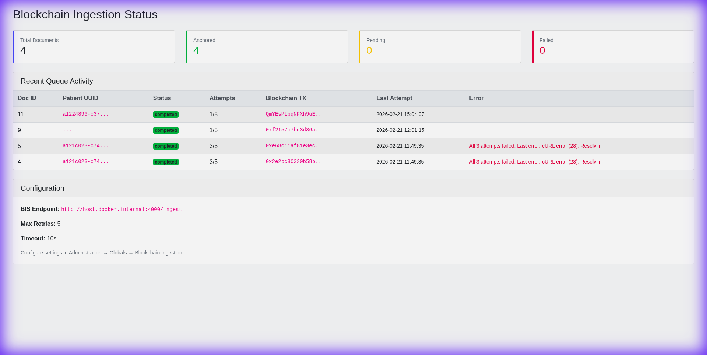
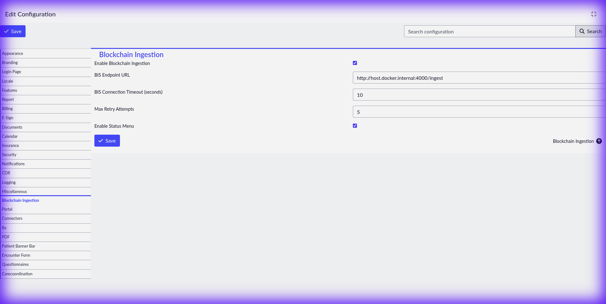

# 🔗 OpenEMR Blockchain Ingestion Module (BIM)

**Event-driven blockchain anchoring for OpenEMR patient documents — zero core modifications.**

This OpenEMR custom module detects new patient documents and forwards metadata to an external **Blockchain Ingestion Service (BIS)** for immutable anchoring on **IPFS** or any blockchain. OpenEMR only emits events; all storage/blockchain logic lives in the external BIS microservice.
.....
## Screenshots

### Blockchain Ingestion Status Dashboard


### Module Configuration (Admin → Config → Blockchain Ingestion)


---

## Architecture

```
┌─────────────┐     ┌──────────────────┐     ┌─────────────────┐     ┌──────────────┐
│   OpenEMR   │     │   BIM Module     │     │  BIS Server     │     │  IPFS Node   │
│  (Document  │────▶│  (Background     │────▶│  (ipfs_bis_     │────▶│  (Kubo on    │
│   Upload)   │     │   Service Poll)  │     │   server.js)    │     │   Pi/Server) │
└─────────────┘     └──────────────────┘     └─────────────────┘     └──────────────┘
                           │                         │                       │
                           ▼                         ▼                       ▼
                    ┌──────────────┐         ┌──────────────┐       ┌──────────────┐
                    │  documents   │         │  Returns CID │       │ Pinned data  │
                    │  table       │         │  + hash back │       │ visible in   │
                    │  (chain_     │         │  to OpenEMR  │       │ IPFS Web UI  │
                    │   status)    │         └──────────────┘       └──────────────┘
                    └──────────────┘
```

### How It Works

1. **User uploads** a document to a patient in OpenEMR
2. **Background service** polls every 60s for new documents (`chain_status IS NULL`)
3. **Metadata payload** (patient UUID, doc ID, MIME type, hash, category) is sent via `POST` to the BIS endpoint
4. **BIS uploads** the metadata JSON to the IPFS node, pins it, and writes to MFS
5. **IPFS returns** a Content Identifier (CID) — the immutable hash-based address
6. **Documents table** is updated with the CID and status → `anchored`
7. **Failed requests** are retried with exponential backoff (60s, 120s, 240s…)

---

## File Structure

```
oe-module-blockchain-ingestion/
├── info.txt                          # Module description (Module Manager)
├── table.sql                         # SQL migration (schema + background service)
├── openemr.bootstrap.php             # Module entry point
├── moduleConfig.php                  # Config loader
├── ModuleManagerListener.php         # Lifecycle hooks (enable/disable/unregister)
├── ipfs_bis_server.js                # 🔗 Real IPFS BIS server (production)
├── mock_bis_server.js                # 🧪 Mock BIS for testing (fake hashes)
├── public/
│   └── index.php                     # Admin status dashboard entry point
└── src/
    ├── Bootstrap.php                 # Event subscriptions (globals + menu)
    ├── GlobalConfig.php              # Module settings management
    ├── BlockchainIngestionClient.php  # REST client with cURL + retry logic
    ├── BackgroundBlockchainService.php # Background queue processor
    └── StatusPage.php                # Admin dashboard view
```

---

## Quick Start (Full Setup)

### Prerequisites
- Docker & Docker Compose
- Node.js (v16+)
- An IPFS node running (Kubo) — or use the mock server for testing

### Step 1 — Start OpenEMR

```bash
cd docker/development-easy
sudo docker compose up
```

Wait for **"Starting apache!"** message (~5-10 min on first run).

| Service | URL | Credentials |
|---|---|---|
| OpenEMR | http://localhost:8300 | `admin` / `pass` |
| phpMyAdmin | http://localhost:8310 | `openemr` / `openemr` |

### Step 2 — Start the BIS Server

**Option A — Real IPFS (production):**
```bash
node ipfs_bis_server.js
```
Connects to IPFS node at `10.211.171.140:5001`. Update the IP in the file if your node is at a different address.

**Option B — Mock server (testing):**
```bash
node mock_bis_server.js
```
Returns fake transaction hashes — no IPFS required.

Both listen on `http://localhost:4000/ingest`.

### Step 3 — Install & Enable the Module

1. Open **http://localhost:8300** → login as `admin` / `pass`
2. Go to **Admin → Modules → Manage Modules**
3. Find **"Blockchain Ingestion Module"** → **Register** → **Install** → **Enable**

### Step 4 — Configure the Module

1. Go to **Admin → Config**
2. Click **"Blockchain Ingestion"** in the left sidebar
3. Set:
   - ✅ **Enable Blockchain Ingestion** → checked
   - **BIS Endpoint URL** → `http://host.docker.internal:4000/ingest`
   - **Timeout** → `10`
   - **Max Retries** → `5`
4. Click **Save**

> **⚠️ Important:** Use `host.docker.internal` (not `localhost`) because OpenEMR runs inside Docker but the BIS runs on your host machine.

### Step 5 — Test It

1. Go to **Patient → Find Patient** → select a patient
2. Go to **Documents** tab → upload any file
3. Wait ~60 seconds for the background service to poll
4. Watch the BIS terminal — you'll see the ingestion request
5. Check results:
   - **BIS Terminal**: Shows document metadata + IPFS CID
   - **Status Dashboard**: **Modules → Blockchain Ingestion** in OpenEMR menu
   - **phpMyAdmin**: `SELECT blockchain_tx, record_hash, chain_status FROM documents`
   - **IPFS Web UI**: Check `/openemr/documents/` in the Files section
   - **IPFS Gateway**: `http://YOUR_IPFS_IP:8080/ipfs/<CID>`

### Resetting Failed Documents

If documents fail (e.g., BIS wasn't running), reset them in phpMyAdmin:

```sql
UPDATE documents SET chain_status = NULL WHERE chain_status = 'failed';
UPDATE mod_blockchain_queue SET status = 'pending', attempts = 0, next_retry_after = NULL WHERE status = 'failed';
```

---

## Configuration

| Setting | Default | Description |
|---|---|---|
| `blockchain_ingestion_enable` | `false` | Master enable/disable toggle |
| `blockchain_ingestion_bis_endpoint` | `http://localhost:4000/ingest` | BIS microservice URL |
| `blockchain_ingestion_bis_timeout` | `10` | HTTP timeout in seconds |
| `blockchain_ingestion_max_retries` | `5` | Max queue-level retry attempts |
| `blockchain_ingestion_enable_menu` | `true` | Show status page in admin menu |

---

## Database Schema Changes

### New columns on `documents` table

| Column | Type | Description |
|---|---|---|
| `blockchain_tx` | `VARCHAR(255)` | IPFS CID or blockchain TX hash from BIS |
| `record_hash` | `VARCHAR(255)` | SHA-256 hash of the metadata |
| `chain_status` | `VARCHAR(32)` | Status: `NULL` → `pending` → `anchored` \| `failed` |

### New table: `mod_blockchain_queue`

Tracks ingestion attempts with columns for payload, attempt count, retry scheduling, and error messages.

---

## BIS Payload Format

### Request (OpenEMR → BIS)

```json
{
  "patient_uuid": "95f2c42e-6b28-4a61-baf0-123456789abc",
  "document_id": 42,
  "file_hash": "a3f2b8c9d1e0...",
  "mime_type": "application/pdf",
  "timestamp": "2026-02-21T12:00:00+05:30",
  "category": "Lab Report",
  "source_system": "OpenEMR",
  "event_type": "document.created"
}
```

### Response — IPFS BIS

```json
{
  "status": "anchored",
  "blockchain_tx": "QmXy7z8a9bC3d4E5f6G7h8I9j0...",
  "record_hash": "sha256:a1b2c3d4e5f6...",
  "ipfs_gateway_url": "http://10.211.171.140:8080/ipfs/QmXy7z8a9b...",
  "mfs_path": "/openemr/documents/openemr_doc_42_1708520400.json",
  "chain": "ipfs"
}
```

### Response — Mock BIS

```json
{
  "status": "anchored",
  "blockchain_tx": "0x7a8b9c...",
  "record_hash": "sha256:a1b2c3...",
  "block_number": 18234567,
  "chain": "ethereum-sepolia"
}
```

---

## IPFS Integration

The `ipfs_bis_server.js` connects to a Kubo IPFS node and:

1. **Uploads** document metadata as a pinned JSON file via `/api/v0/add`
2. **Writes to MFS** at `/openemr/documents/` via `/api/v0/files/write` (visible in IPFS Web UI)
3. **Returns the CID** to OpenEMR as the `blockchain_tx`

### IPFS Node Configuration

Update the IP in `ipfs_bis_server.js` if your node is at a different address:

```javascript
const IPFS_API_HOST = '10.211.171.140';  // Change to your IPFS node IP
const IPFS_API_PORT = 5001;
```

### Verifying IPFS Health

```bash
curl -s http://localhost:4000/health | python3 -m json.tool
```

---

## Docker Notes

### Linux: `host.docker.internal` Resolution

The `docker-compose.yml` includes `extra_hosts` for Linux compatibility:

```yaml
extra_hosts:
  - "host.docker.internal:host-gateway"
```

This allows the OpenEMR container to reach services running on the host machine (like the BIS server). This is automatically handled on Docker Desktop (Mac/Windows) but requires this config on Linux.

---

## Design Principles

- **Zero core modifications** — ships as a standard OpenEMR custom module
- **Event-driven** — uses OpenEMR's `background_services` polling pattern
- **Separation of concerns** — OpenEMR only emits metadata; BIS handles all IPFS/blockchain logic
- **No secrets in OpenEMR** — no private keys, no encryption; BIS manages all of that
- **IPFS-native** — metadata is content-addressed and pinned for immutability
- **Resilient** — exponential backoff retry at both request and queue levels
- **Observable** — admin dashboard shows real-time stats and queue activity
- **Pluggable** — swap IPFS for Ethereum, Polygon, or Hyperledger by changing the BIS server only

---

## License

GNU General Public License v3.0 — same as [OpenEMR](https://github.com/openemr/openemr/blob/master/LICENSE).
